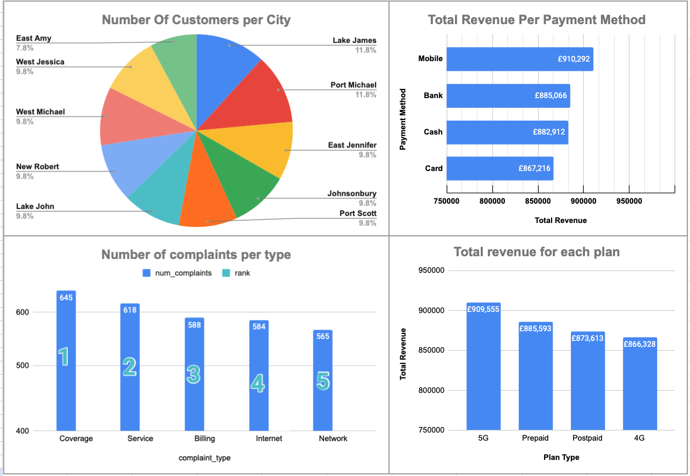

# Telecom Customer Data Analysis

This is a complete data analysis project simulating a telecom company's internal reporting system. It includes real-world steps like data cleaning, SQL-based business analysis, and dashboard creation in Excel.

---

## 📌 Objective

To analyze customer behavior, revenue per subscription plan, complaint patterns, and more — using SQL queries directly inside Python (via DuckDB), after cleaning the data with Pandas.

---

## 📂 Project Structure

/telecom-data-cleaning-analysis-sql-excel/
│
├── data_raw/ # Original dirty CSV files
│ ├── payments.csv
│ ├── customers.csv
│ ├── subscriptions.csv
│ ├── complaints.csv
│ └── call_logs.csv
│
├── analysis_outputs/ # Final CSV results from SQL queries
│ ├── top_10_cities_by_customers.csv
│ ├── total_revenue_per_plan.csv
│ ├── gender_counts_per_plan.csv
│ ├── most_complaint_types.csv
│ ├── total_payments_by_method.csv
│ ├── top_3_customers_per_plan.csv
│ ├── customers_per_plan.csv
│ └── avg_monthly_payment_per_plan.csv
│
├── dashboard/
│ └── telecom_dashboard.xlsx # Final Excel dashboard (with charts)
│
├── notebook/
│ └── telecom_analysis.ipynb # Full Jupyter Notebook
│
└── README.m 

---

## 🛠️ Tools Used

- **Python (Pandas)** – for data cleaning and formatting  
- **DuckDB (SQL)** – to write real SQL queries inside Jupyter Notebook  
- **Jupyter Notebook** – to document and execute the workflow  
- **Excel** – for creating charts and dashboards from SQL output  

---

## 💡 Key Business Questions Answered

- 📍 What are the **Top 10 cities** by number of customers?  
- 💰 What is the **total revenue per subscription plan**?  
- 👥 In each plan, are there **more male or female** customers?  
- 💳 What are the most used **payment methods**?  
- 🧾 Who are the **top 3 paying customers in each plan**?  
- 📢 What are the **most common complaint types**?  
- 💸 What's the **average monthly payment per plan**?  

---

## 📊 Sample Charts (Excel)

After running all SQL queries and exporting results to CSV, the insights were visualized using Excel. The dashboard includes:

- Bar charts for revenue  
- Pie charts for gender distribution  
- Line graphs for trends  
- Complaint breakdowns  

---

## 🔥 Why This Project?

This project is designed to showcase:
- Strong understanding of the **data analysis pipeline**  
- Ability to clean and prepare real-life dirty data  
- Writing **advanced SQL queries** (CTEs, window functions)  
- Turning data into **clear business insight**  

---

## 👤 About Me

I'm a self-taught data analyst with a commerce background and deep interest in business data, SQL, and reporting. I built this project to show how real companies can benefit from structured data cleaning and analysis.

---

## 📥 How to Run It

1. Clone the repo  
2. Install requirements (Pandas, DuckDB)  
3. Open `notebook/telecom_analysis.ipynb`  
4. Explore the results or open `dashboard/telecom_dashboard.xlsx`  

---

## ✅ Status

🟢 Project complete – working on final visual enhancements and polishing dashboard.

